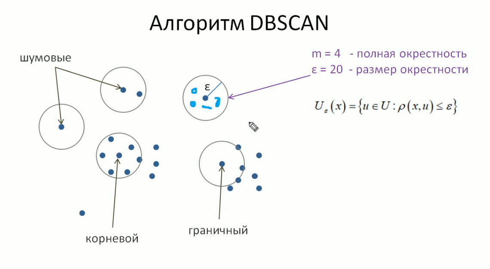
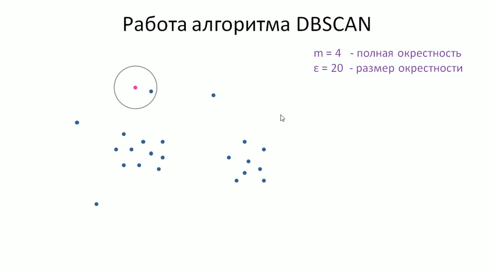
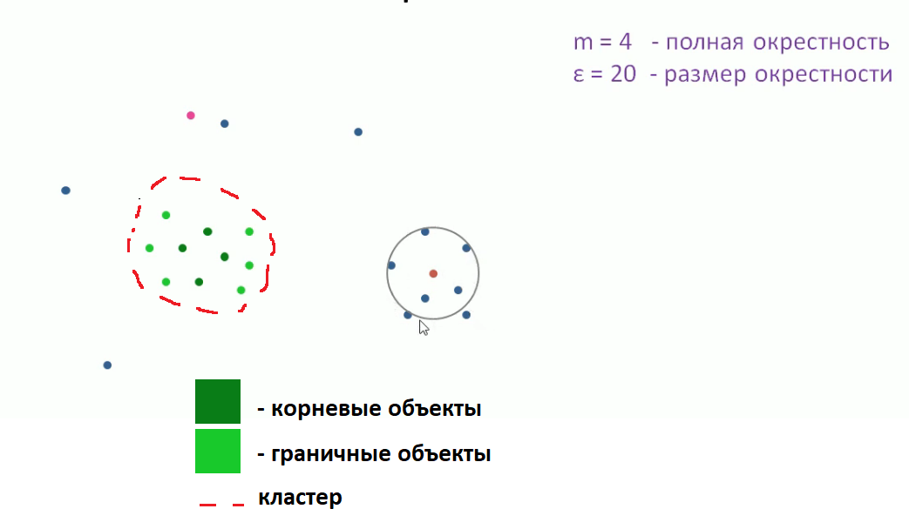
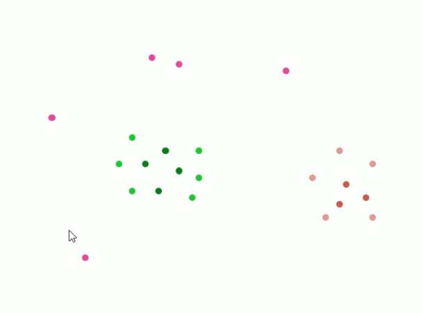
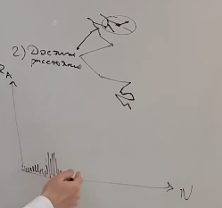
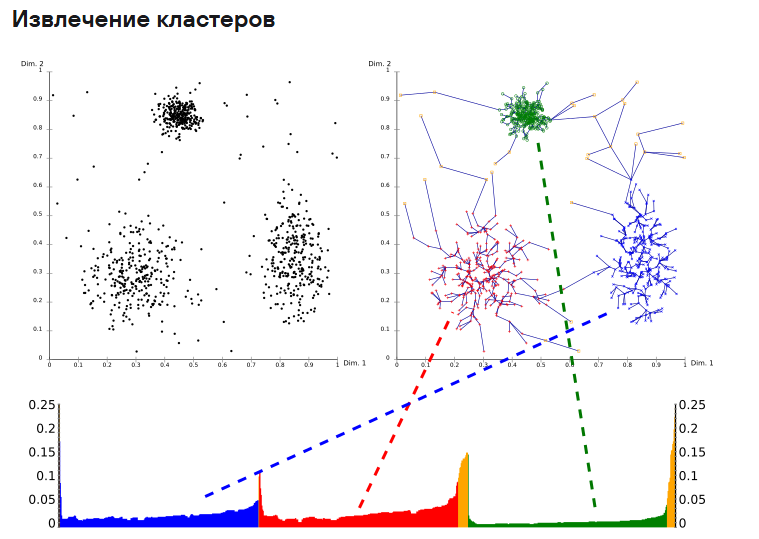
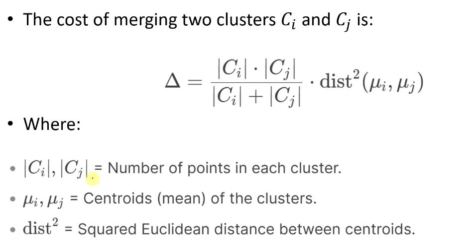
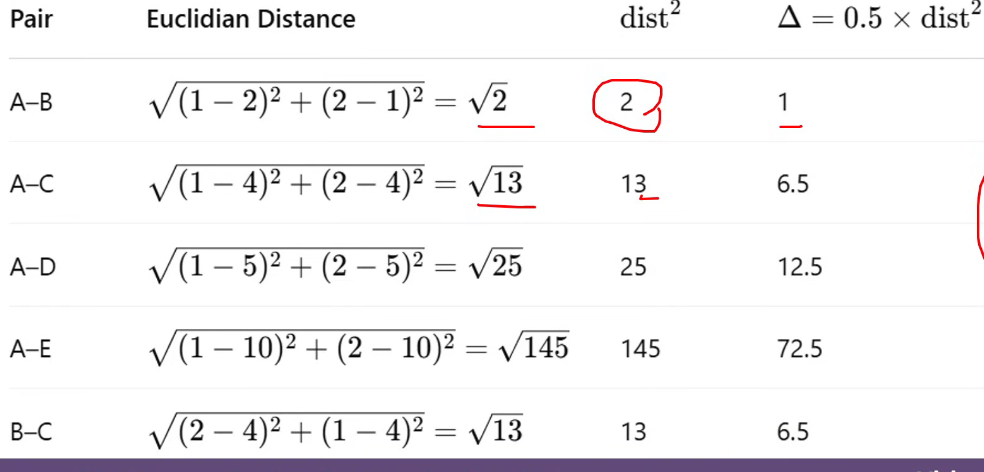
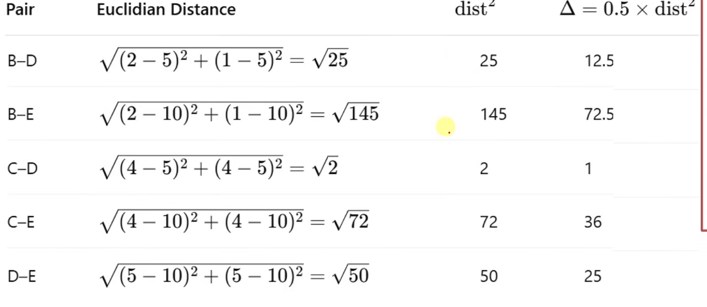
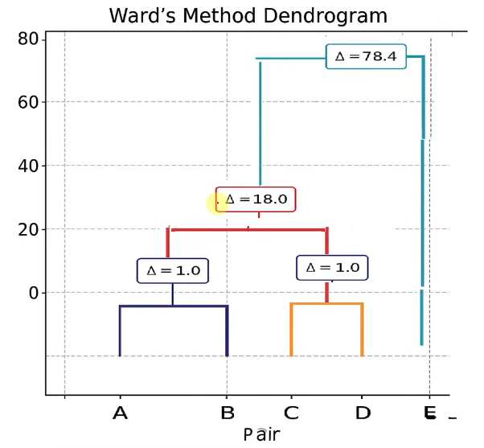

# Анализ пяти методов кластеризации данных:
- [Метод средний К](#k-means)
- [DBSCAN](#dbscan)
- [HDBSCAN](#hdbscan)
- [Optics](#optics)
- [Ward](#ward)

---
Все упамянутые алгоритмы используются для анализа BigData.

## K-means
Источники: [Видео-разбор метода](https://youtu.be/R_w7PnKWOgw?si=NYQKVlnQGBGmZh1w), [статья на Хабр 1](https://habr.com/ru/companies/skillfactory/articles/877684/), [статься на Хабр 2](https://habr.com/ru/articles/829202/).
Предварительно решается сколько будет кластеров. Количество задаётся произвольное, но от нео зависит качество анализа.
В качестве входных данных выступают точки на оси координат X и Y. Они отмечаются на координатной плосткости. 

Далее необходимо рассатвить случайным образом "опорные точки" для каждого из будущих кластеров - центроидов. Центроиды не обязательно должны быть из того же DataSet, что и остальные точки, однако они не выбираются случайным образом. 

Далее вычисляются расстояние входных точек до центроидов. На основе расстояния точек до центроид происходит их распределение к тому или иному класетеру.

После определения каждой точки к одному из кластеором (в нашем случае 2), необходимо переопределить центроиду, чтобы та оказалась в центре именно кластера.

После переноса центроиды происходит повторное переопределение точек кластера. Происходит это из-за переноса центроиды. В связи с этим некоторые точки могут перейти из одного кластера в другой из-за смены расстрояния дл центроид.

После проведённых расчётов алгоритм вновь пересчитает центроиду для кластера. Делает это алгоритм до тех пор, пока каждая точка не будет соответсвовать своему кластеру. 

### Проблемы метода
Основными проблемами метода являются:
- чувствительность к изначальному выбору числа разбиения на кластеры
- выбор точек для центроид

Для определения количества кластеров можно воспользоваться "методом локтя". Выполняем кластеризацию для различных значений k и строим график зависимости суммарной внутрикластерной дисперсии от количества кластеров. Внутрикластерная дисперсия (или сумма квадратов расстояний между объектами и их центроидом) показывает, насколько компактными являются кластеры. Чем меньше внутрикластерная дисперсия, тем более «упорядочены» и «однородны» кластеры.
1. Запускаем алгоритм k-means для разных значений kkk, например от 1 до 10.
2. Вычисляем внутрикластерную дисперсию для каждого значения kkk. Это можно сделать с помощью метрики, которая рассчитывает сумму квадратов расстояний между точками данных и центроидом их кластера - **WCSS**.
3. Строим график: на оси X откладываем значения kkk, а на оси Y — соответствующие значения внутрикластерной дисперсии.
4. Ищем «локоть» на графике: это точка, где дальнейшее увеличение числа кластеров не приводит к значительному снижению внутрикластерной дисперсии.

## DBSCAN
[Источник](https://youtu.be/svAtnZ5XjSI?si=G_R5MseHMywYE7r1)
Данный метод имеет несколько преимуществ перед K-means:
1. Он может находить кластеры произвольной формы
2. Он может самостоятельно определять их количество

Метод зиждиться эвристиках, придуманных его создаталеями, здесь нет строгой математики, как например в прошлом методе. Понятие "эпсилон окрестность объекта". Такая окрестрость - множество точек, удалённых от X не более чем на эпсилон, больший 0. Этот парамент мы задаём самостоятельно. 
Данный метод разделяет три вида объектов: шумовые, граничные, корневые.

Признаки объектов:
- корневой: имеет в своей окрестности **не менее** m объектов
- граничный: не корневой, но и не шумовой
- шумовой: выброс

### Начало работы алгоритма
В наборе данных случайным образом выбирает объект. Рассматриваем его эпсилон окрестность и относим к одному из трёх видов ранее упамянутых объектов. Если вектор определяется как **"корневой"**, то для всех входящих в его ЭО процедура определения типа повторяется. Если объект не имеет достаточное кол-во объектов внутри своей ЭО, тогда он помечается как **"граничный"**. Для всех корневый объектов вновь повторяется определение типа объектов.
Начало:

Промежуточный результат:

Финал кластеризации:

Как видно из картинки: имеем два кластера, корневые, граничные и шумовые объекты. Количество кластеров определео в соотсевтвии с заданными в самом начале параметрами m и e (4 и 20 соотвественно).

## HDBSCAN
[Источник](https://www.geeksforgeeks.org/machine-learning/hdbscan/)
HDBSAN исследует плотность точек данных в наборе данных. Он начинается с вычисления иерархии кластеризации на основе плотности, которая создает кластеры из плотно связанных точек данных. Эта иерархическая структура позволяет распознавать кластеры различных форм и размеров.

Затем алгоритм извлекает кластеры из иерархии, принимая во внимание стабильность назначений кластеров на разных уровнях иерархии. Он идентифицирует стабильные кластеры как кластеры с постоянным членством на нескольких уровнях, обеспечивая надежность формирования кластеров.

Кроме того, HDBSCAN различает шум и значимые кластеры, принимая во внимание точки с низкой плотностью или точки, не принадлежащие ни к одному кластеру. HDBSCAN фиксирует и устраняет шум, постоянно регулируя параметр минимального размера кластера и добавляя минимальное остовное дерево.

HDBSCAN имеет ряд параметров, которые можно настроить для изменения процесса кластеризации в соответствии с конкретным набором данных. Вот некоторые из основных параметров:

**'min_cluster_size'**: Этот параметр устанавливает минимальное количество точек, необходимое для формирования кластера. Точки, не соответствующие этому критерию, считаются шумом. Регулировка этого параматера влияет на зернистость кластеров, обнаруженных альгойртмом.
**'min_samples'**: Он устанавливает минимальное количество выборок в районе, чтобы точка считалась основной точкой.
**'cluster_selection_epsilon'**: Этот параметр устанавливает эпсилон значение для выбора кластеров на основе минимального остовного дерева. Он определяет максимальные расстояния, разрешенные между точками, чтобы их можно было считать связанными в процессе кластеризации на основе плотности.
**"метрический"**: Метрика расстояния, которую следует использовать для расчета расстояния взаимной достижимости.
**'cluster_selection_method'**: Этот метод используется для выбора кластеров из сгущенного дерева. Это может быть 'eom' (Превышение массы'), 'лист' (кластерный древесный лист), 'Leaf-dm' (лист с метрикой расстояния) или 'плоский' (плоская кластеризация).
**"alpha"**: Параметр, который раздувает критерий сцепления для слияния кластеров.
**'gen_min_span_tree'**: Если параметр истинный, он генерирует минимальное остовное дерево для последующего использования.
**"метрические_парамы"**: Это дополнительные аргументы ключевых слов для метрической функции.
**"алгоритм"**: Алгоритм использования взаимного расстояние достижимости вычисление. Опции включают 'лучший', 'общий', 'прайм_кдтри', и 'борувка_кдтри'.
**'core_distance_n_jobs'**: Количество параллельных заданий, которые необходимо выполнить для расчета расстояния до ядра.
**'allow_single_cluster'**: Логическое значение, указывающее, разрешать ли выходы одного кластера.

## OPTICS
[Статья Ру-Вики](https://ru.ruwiki.ru/wiki/Алгоритм_кластеризации_OPTICS), [Видео](https://youtu.be/oSvqADO6FEA?si=6Bf5sA63T3_EVk4t)

Данный алгоритм смотрит на кластеризацию немного иначе. Главным образом метод опирирует плотностью точек для построения кластеров. Чем оперирует:
1. Основные расстояние - минимальное количество точек внутри определённого радиуса и расстояние до соседей.
2. Достижимое расстояние - максимальное расстояние точки от своих соседей внутри окружности.

Как работае алгорит: выбирается точка, измеряется основное и достижимое расстояние до соседей. Строится такой граф, что от точки проводится линия до самого ближайшего соседа.

На графике отражается расстояние до соседей. Получается что где-то график будет "плотнее". Важно знать, что сам метод не разбирает данные на кластеры, он лишь создаёт график, где указывает на то, на сколько плотно расположены к друг другу точки на координатной плоскости. Можно выбрать максимальные значения и при помощи отсечек разбить плотности на кластеры. Автор видео назвал такое явление как "долины кластеров". Алгоритм опирирует меньщим количеством параметров чем остальные.

## WARD

[Видео-инструкция из Индии](https://youtu.be/TyHwiXkB-Ps?si=SJdfh9eCSkHbvLcV)

Суть метода заключается в том, что представить изначально все точки как отдельные кластеры, чтобы далее начать их объединять и минимизировать число кластеров, которые входят друг в друга. 
Для начала процесса объединения кластеров необходимо вычислить параметр **дельта**.

После вычисления всех комбинаций кластеров их дельт, нужно определить минимальную. Если получается так, что несколько дельт равны, берём первую из всех равных, что мы посчитали и производим объединение кластеров. После определения того, какие кластеры будут объеденены, нужно перечистать его центроиду, так как раньше каждый кластер буквально ею и был. Далее алгоритм повторяется. После объединения всех значений к один кластер рисуется следующая диаграмма.
